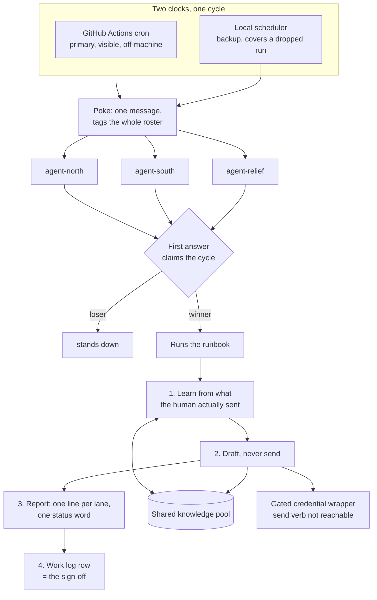
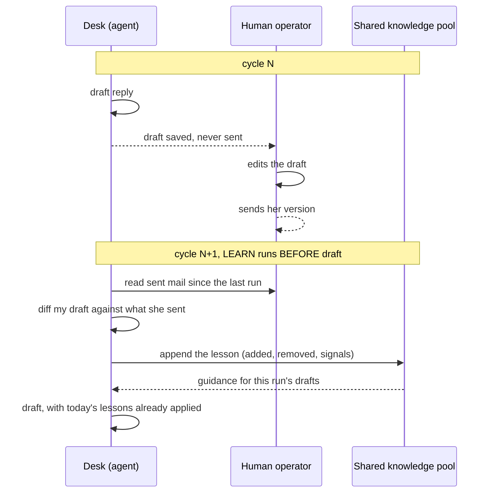

# agent-ops-framework

A model agnostic, agent agnostic operating model for running a professional
desk's recurring work with AI agents, plus a runnable reference implementation
of every moving part.

This is the distilled architecture of a production desk I run daily: scheduled
work that has to happen whether or not any particular agent, model or vendor is
awake, where the output goes out under a human's name, and where the desk is
expected to get better at the job every week without anyone retraining it.

The domain in this repo is fictional (a small bakery's supplier desk). The
architecture is not.

```
git clone https://github.com/joydai2026-del/agent-ops-framework
cd agent-ops-framework
python3 -m unittest discover -s tests      # 52 tests, no dependencies
python3 scripts/run_cycle.py --agent agent-north --keep-claim
python3 scripts/run_cycle.py --agent agent-south   # stands down, cycle taken
```

---

## The operating model

Six pieces. Each one exists because a specific way of running agents fails
without it.



### 1. Scheduled pokes, with a second clock behind the first

The schedule is a cron in GitHub Actions that sends exactly one message to the
roster. A local scheduler runs the same poke as a backup.

Why two clocks: every scheduler drops runs. Hosted cron is late at busy hours
and occasionally skips a run outright; a laptop scheduler is only as awake as
the laptop. Neither alone is a clock you can staff a desk on. Two independent
clocks plus a claim lock means a duplicate poke is harmless and a missed poke is
covered.

Why the visible one is primary: a job running silently on a personal machine is
a job nobody can see fail. Hosted runs have a public history, so a stakeholder
can answer "did it run this morning" without asking an agent.

Why the poke carries no work logic: the sender is an alarm clock and nothing
else. The work lives in a runbook. A schedule change then cannot break the work,
and a work change cannot break the schedule. In `scripts/send-poke.sh` this is
enforced by the file being 40 lines of config reading and one send.

### 2. A roster, where the first answer claims the cycle

The poke tags every agent on the roster. Whichever one is alive, funded, and not
rate limited answers first and owns the cycle. Everyone else stands down.

Why a roster and not an assignment: agents go down. Models get deprecated,
credentials expire, a vendor has an outage, a rate limit hits at exactly the
wrong hour. Assigning a cycle to one agent makes every one of those a missed
day. A roster makes them a non-event, and it makes the model choice a config
line rather than an architectural commitment.

Why claiming and not coordination: the alternative is a scheduler that knows
which agents are healthy, which is a second system that can itself be wrong. The
claim is a file created with `O_CREAT|O_EXCL`, atomic on any shared filesystem.
The winner is whoever writes first. There is nothing to keep in sync.

Every claim carries a lease. An agent that dies mid cycle cannot wedge the desk
forever: after the lease expires another agent takes over, and the takeover is
recorded so the work log shows a cycle was rescued rather than silently rerun.
See `agentops/claim.py` and its ten tests.

### 3. Runbooks as versioned playbooks any model can execute

A cycle is a markdown file: a small machine readable header (cycle id, lanes,
lease) over prose instructions.

```markdown
---
cycle: morning-supplier-sweep
lanes: [learning, drafting, deliveries]
---
## 1. Learning lane (always first)
Read every message the owner sent since the last run...
```

Why a file and not a prompt: a prompt lives inside one vendor's agent and dies
with it. A runbook is reviewed in a pull request, diffed when it changes, and
executed by whichever model happens to be awake. Changing what the desk does is
a commit with a reason attached, not a re-prompting session nobody can audit.

Why the header is machine readable: the code needs the lanes, because lane
coverage is what stops a lane quietly disappearing from the reports. The prose
below it is what the model follows. One file, both readers, no drift between the
documentation and the thing that runs.

Nothing in a runbook names a model. Model routing is a convention (the agent
that claims the cycle is the router, and it sends each step to the cheapest
model that can do that step well), so swapping vendors never touches the work.

### 4. Drafts only, made architectural

The desk drafts. The human sends. Everything user visible goes out under her
name, after her eyes.

The naive way to build this is a rule in the prompt. That is a policy promise:
it holds as long as every agent, on every model, forever, follows it. One
confused agent, one prompt injection in an inbound message, one model swap, and
the promise is gone with no trace.

So the guarantee lives below the agent instead, in the credential wrapper
(`bin/mailer-gw`). The agents are given the wrapper and never the underlying
client. The wrapper refuses the send verb, exits 3, and says so on stderr. An
agent that decides to send has nothing to send with.

```
$ bin/mailer-gw send --thread t-alpine-dairy
BLOCKED by mailer-gw: this desk drafts only; sending is the owner's action.
Reading, drafting and labelling all pass through unchanged.
To permit this one call: MAILER_GW_ALLOW_SEND=1 mailer-gw send --thread t-alpine-dairy
$ echo $?
3
```

This matters because no mail provider offers a scope that grants drafting
without granting sending. The capability the desk needs does not exist upstream,
so it is constructed at the boundary the desk controls. **Prefer a capability
guarantee over a policy promise wherever the boundary is yours to build.** The
escape hatch is per call and explicit, so a human who wants one send has to say
so for that one command.

### 5. Silence is not allowed

Every cycle ends with one line per declared lane and exactly one status word:
`COMPLETE`, `ZERO WORK`, `PARTIAL`, `BLOCKED`.

Why "nothing to do" must be said out loud: an agent that stays quiet when it
found no work is indistinguishable from an agent that never woke up. Those two
states need different responses and they look identical from outside. `ZERO
WORK` is a result, and reporting it is how a healthy quiet day is told apart
from a dead scheduler.

Why lane coverage is mechanical: a lane that had no work is exactly the lane
that quietly falls out of the report, and three weeks later nobody can say when
it stopped running. So lanes are declared in the runbook, the report object
refuses an undeclared lane, and a missing lane downgrades the whole cycle to
`PARTIAL` and prints as `NOT RUN`. The status word is derived from the lane
lines, never typed by the agent describing its own work.

### 6. A work log any stakeholder can read

The last step of every cycle appends one row to a table: date, cycle, agent,
status, one column per lane, notes, sign-off time.

**No row means the cycle did not finish.** That single sentence is the whole
value. Nobody has to read a chat transcript, dig through logs, or trust an
agent's summary of itself. They open one table and see the week.

It is CSV here and a shared spreadsheet in production, which is deliberate: a
spreadsheet, a terminal, `git diff`, and every language can read it. That is
what "agent agnostic" has to mean once the humans are included. The same table
also answers what did NOT finish (`worklog.missing_cycles`), which is what turns
a diary into a monitor and gives the next cycle its catch-up list.

A lane a cycle does not run is written `n/a`, which reads differently from a
lane that was supposed to run and did not (`NOT RUN`). Blurring those two is how
a broken lane hides.

---

## The learn first loop

This is the part that makes the desk get better rather than merely keep up.

The human sends 100% of the mail. That is the safety property. It is also the
richest possible training signal, because whatever she actually sent is ground
truth for how this desk answers, and it arrives free, every day, without anyone
labelling anything.



Three cases, all learned from:

| Case | What is read | Why it counts |
|---|---|---|
| She edited my draft before sending | The **diff** between my draft and her sent message | The highest value signal in the system. Her edits are literally the correction: what she softened, what she cut, who she routed to, what she refused to commit to |
| She replied before any draft existed | The whole message | No diff available, so the message itself is the model |
| She originated mail on a thread the desk never saw | The whole message | The goal is a durable model of how the desk is run, not only draft repair |

Three properties make it work:

**Learn before you draft.** The learning pass is the first lane of every cycle,
so the drafts written this run already carry this run's lessons. Learning after
drafting is one full cycle too late, every cycle, forever.

**The pool is shared, never private.** Lessons go to a file in the project
folder that every agent reads. A lesson inside one agent's private memory is a
silo the next agent cannot see, and a desk with a roster changes agents
constantly. She should never have to teach the same edit twice, no matter which
model picks the work up next.

**Deduplicated by fingerprint, watermarked by time.** A re-poked cycle, or an
agent that took over a stale claim, cannot double count. The pool tracks the
latest sent message it has already learned from, so the next run starts exactly
where the last one stopped.

### The gate the loop depends on

Reading sent mail is also what stops the desk answering a thread the human
already answered.

**The sent reply gate:** load the whole thread including sent mail, find the
newest message, and if it is outbound, the thread is closed. Do not draft.

This looks obvious and is the single most expensive bug in the category. An
agent that reads the inbound message alone is blind to the reply the human sent
two hours ago. It then produces a duplicate, and worse, the duplicate usually
contradicts the position she already took, because it was written without ever
seeing that position. The fix is not a reminder to read carefully. It is a
mechanical step with a test named after the failure
(`test_the_gate_needs_the_whole_thread_not_just_the_inbound_message`).

---

## What is in the box

```
agentops/            the framework, standard library only, no vendor SDK
  claim.py           lease based cycle claiming, atomic, takeover recorded
  runbook.py         versioned playbooks with a machine readable header
  report.py          four status words, lane coverage, derived status
  worklog.py         the stakeholder readable sign-off table
  learning.py        sent reply gate, draft diffing, the shared knowledge pool
  mailbox.py         a file backed transport adapter, swappable for a real one

desk/                the demo desk: a fictional bakery's supplier desk
  CONVENTIONS.md     the rules binding any agent on any model
  runbooks/          two cycles: a morning sweep and an hourly sweep
  channel/           poke.conf (roster as config) and the poke texts
  data/              fabricated inbound, sent and draft mail

bin/mailer-gw        the gated credential wrapper: send is not reachable
scripts/send-poke.sh the alarm clock, zero work logic
scripts/run_cycle.py one full cycle end to end
tests/               52 tests over the claim, report, log and learning logic
```

The reference implementation has **no dependencies**. Not a stylistic
preference: the pieces that carry the operating model are a lock file, four
status words, a CSV, a markdown file and a JSONL pool, and keeping them that
small is what lets any model, any agent runtime, and any human operate the desk.

### Try the interesting parts

```bash
# Two agents poked at once: one claims, one stands down
python3 scripts/run_cycle.py --agent agent-north --keep-claim
python3 scripts/run_cycle.py --agent agent-south

# A dead agent does not wedge the desk: a one second lease expires, relief takes over
python3 scripts/run_cycle.py --agent agent-north --keep-claim --lease 1
sleep 2 && python3 scripts/run_cycle.py --agent agent-relief

# The credential refuses to send, and says so
bin/mailer-gw send --thread t-alpine-dairy; echo "exit $?"

# The alarm clock, with the roster it would wake
scripts/send-poke.sh desk/channel poke-morning.txt

# What the human can read without asking an agent
cat desk/work-log.csv
cat desk/knowledge/learning-pool.jsonl

scripts/reset-demo.sh   # back to the seeded state
```

A demo run on the seeded data closes four threads through the sent reply gate,
drafts two, and writes four lessons: one draft edit, two direct replies, one
originated message the desk never saw.

---

## Design notes worth stealing

**Config files are data, never code.** `poke.conf` is read key by key, never
sourced. Sourcing a config file hands arbitrary shell execution to anyone who
can edit the config, including anything that can write to the repo.

**A poke that mentions nobody wakes nobody, and it fails green.** The sender
refuses to send an unmentioned poke unless the config explicitly opts in. The
failure mode this prevents is the nastiest kind: a successful workflow run, a
cycle that never happened, and a gap only visible days later in the work log.

**Optional keys must not kill the script.** `grep` exits 1 on a missing key;
under `set -euo pipefail` that terminates the sender before it sends, in 30
milliseconds, with no error message and a green run. The `|| true` in
`conf_get` is load bearing and has a comment saying so, because that exact
combination once broke every scheduled run while the test channel passed.

**Derive the status, do not ask for it.** An agent reporting on its own work is
the wrong narrator. The status word is computed from the lane lines.

**Idempotency at every write.** Claims are re-entrant for the holder, work log
rows are keyed by date and cycle, and the learning pool is deduplicated by
fingerprint. With two clocks and a roster, the same cycle WILL sometimes be
attempted twice, and the correct response is for that to be boring.

---

## Author context

Built and run daily by JJ Dong, in a professional operations role, to handle
recurring employer facing work. The framework here is mine; the desk's real
data, contacts and institutional content are not in this repository and never
will be. The demo domain is invented for that reason.

MIT licensed. See [LICENSE](LICENSE).
